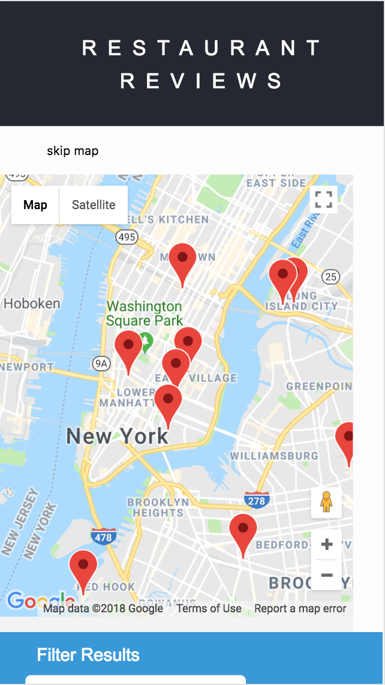

# Restaurant Review App

Restaurant review app provides a list of restaurants on the map and a user can interact with this app by clicking on a restaurant they are interested in, or narrow down a specific region or a type of food with the filter.

This app is friendly for mobile and screen-reader users. It is also able to work offline by caching some assets with a service worker.

## How to run the code

Note: the following description is adapted from [Udacity class project](https://github.com/udacity/mws-restaurant-stage-1)

> In the project folder, start up a simple HTTP server to serve up the site files on your local computer. In a terminal, check the version of Python you have: `python -V`. If you have Python 2.x, spin up the server with `python -m SimpleHTTPServer 8000` (or some other port, if port 8000 is already in use.) For Python 3.x, you can use `python3 -m http.server 8000`. If you don't have Python installed, navigate to Python's [website](https://www.python.org/) to download and install the software.

With your server running, visit the site: `http://localhost:8000`, and enjoy.
